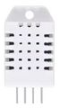
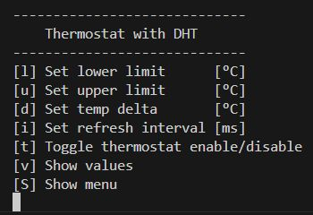
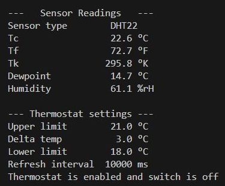

## Universal Thermostat with DHT11/22 Sensor
In this program, the universal thermostat is operated with a DHT sensor 
instead of the NTC sensor.

It measures

- Temperature in °C, °F, °K
- relative Humidity in %

an calculates the dew point.

|Command Line Interface|Output|
|:--------------------:|:----:|
|||